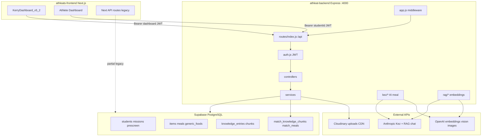
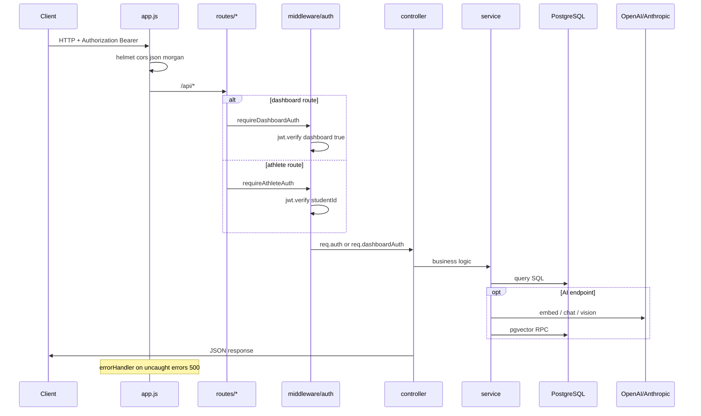
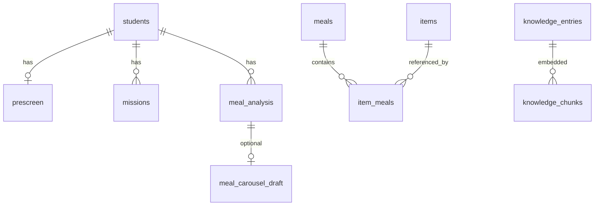
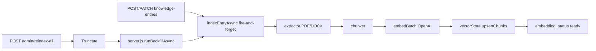
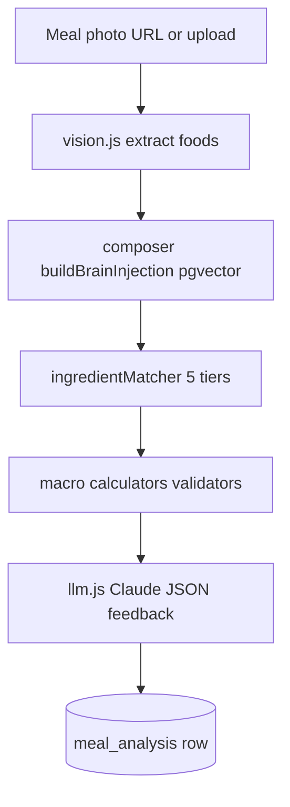
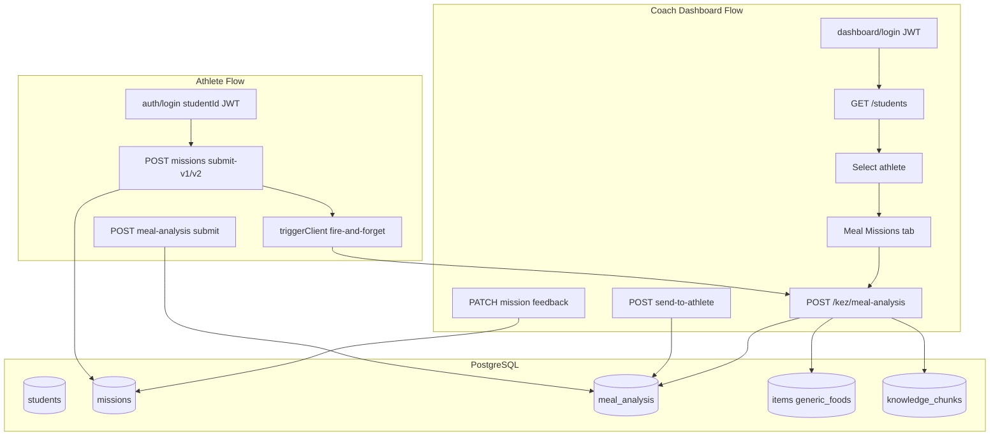

# Athleat Backend — Complete System Architecture Walkthrough

## 1. What This System Is

Athleat is a **nutrition coaching platform** for athletes, operated by coaches through **Kerry’s Dashboard**. The repo is a **two-app layout** (not a formal monorepo root):

| App | Path | Role |
|-----|------|------|
| Backend API | [`athleat-backend/`](athleat-backend/) | Express 5, port **4000**, all business logic |
| Frontend | [`athleats-frontend/`](athleats-frontend/) | Next.js — coach admin UI + athlete dashboard |

**Single database:** Supabase-hosted **PostgreSQL** accessed by the backend via `pg` ([`athleat-backend/src/config/postgres.js`](athleat-backend/src/config/postgres.js)). The frontend sometimes uses **Supabase JS** for athlete auth reads only — same DB, different client.

There is **no repository layer** and **no ORM**. Pattern is **Routes → Controllers → Services → raw SQL**.

---

## 2. High-Level Architecture



**Mental model:** One Express API is the **system of record** for coach operations, Kez AI, kitchen library, and RAG. The frontend is primarily a **thin HTTP client** with tokens in `localStorage`.

---

## 3. Entry Point and Boot Sequence

**Entry:** [`athleat-backend/src/server.js`](athleat-backend/src/server.js)  
**App factory:** [`athleat-backend/src/app.js`](athleat-backend/src/app.js) (exports `app`, does not listen)

Boot order:

1. Load env from [`config/env.js`](athleat-backend/src/config/env.js)
2. `pool.query("select 1")` — verify Postgres
3. `vectorStore.ensureIndex()` — verify pgvector extension + `knowledge_chunks` table
4. `app.listen(PORT)` — default **4000**
5. If pgvector OK + `OPENAI_API_KEY` → **`runBackfillAsync()`** (non-blocking knowledge embedding backfill)

Deployment: [`vercel.json`](athleat-backend/vercel.json) exposes `server.js` as serverless (300s max).

---

## 4. Request Lifecycle (End-to-End)



### Middleware stack ([`app.js`](athleat-backend/src/app.js))

| Order | Middleware | Purpose |
|-------|------------|---------|
| 1 | `helmet()` | Security headers |
| 2 | `cors({ origin: "*" })` | Permissive CORS for local/dev |
| 3 | `express.json({ limit: "50mb" })` | Large JSON (meal metadata, uploads) |
| 4 | `morgan("dev")` | Request logging; **skips** `GET /api/knowledge-entries` polling noise |
| 5 | `GET /` | Root info JSON |
| 6 | `app.use("/api", apiRoutes)` | All API routes |
| 7 | `errorHandler` | Global 500 + `details: err.message` |

**No** session cookies, **no** Passport — only Bearer JWT.

### Route mounting ([`routes/index.js`](athleat-backend/src/routes/index.js))

- **Public:** `/api/health`, `/api/auth/*` (mixed), `/api/library/*` (taxonomy — no dashboard gate at mount)
- **Dashboard JWT** (`requireDashboardAuth`): students, mission-config, uploads, knowledge-*, meals, foods, eer-config, chat, kez
- **Athlete JWT** (`requireAthleteAuth` on router): all `/api/athlete/*`

---

## 5. Authentication — Two Realms, One Secret

Config: `JWT_SECRET`, `JWT_EXPIRES_IN` (default 30d) in [`config/env.js`](athleat-backend/src/config/env.js).

Implementation: [`middleware/auth.js`](athleat-backend/src/middleware/auth.js)

| Realm | Login | JWT payload | Middleware | Frontend token key |
|-------|-------|-------------|------------|-------------------|
| **Athlete** | `POST /api/auth/signup`, `POST /api/auth/login` | `{ studentId }` | `requireAthleteAuth` → `req.auth.studentId` | `athleat_token` |
| **Coach dashboard** | `POST /api/auth/dashboard/login` | `{ dashboard: true }` | `requireDashboardAuth` → `req.dashboardAuth` | `kerry_dashboard_token` |

**Athlete auth** ([`services/authService.js`](athleat-backend/src/services/authService.js)): bcrypt passwords on `public.students`, issues JWT, seeds `student_unlocks` on signup.

**Dashboard auth** ([`services/dashboardAuthService.js`](athleat-backend/src/services/dashboardAuthService.js)): single row `public.dashboard_credentials` (id=1), bcrypt; optional first-time bootstrap via `DASHBOARD_BOOTSTRAP_PASSWORD`.

**Stub:** `POST /api/auth/forgot-password` returns success without sending email.

**Security note:** Same `JWT_SECRET` distinguishes realms only by payload shape — a token with wrong shape is rejected (401).

---

## 6. Layer Structure (No Repositories)

```
src/
├── server.js          # bootstrap + backfill
├── app.js             # Express config
├── config/            # env, postgres pool, cloudinary, devFlags
├── middleware/        # auth.js, errorHandler.js
├── routes/            # HTTP mapping only
├── controllers/       # req/res, status codes, next(error)
├── services/          # SQL + business logic + AI orchestration
│   ├── kez/           # Virtual Kez meal AI subsystem
│   └── rag/           # Knowledge embeddings + chat
└── utils/             # dateInput, storageUrl
```

### Controllers (HTTP adapters)

Thin: parse body/params, call service, map errors to `next(error)`.

| Controller | Domain |
|------------|--------|
| [`authController.js`](athleat-backend/src/controllers/authController.js) | Athlete + dashboard auth |
| [`athleteController.js`](athleat-backend/src/controllers/athleteController.js) | Profile, missions, prescreen, knowledge-chat |
| [`studentController.js`](athleat-backend/src/controllers/studentController.js) | Coach roster, feedback, Q&A |
| [`kezController.js`](athleat-backend/src/controllers/kezController.js) | Meal analysis, carousel, ingredient tiers (~3k lines) |
| [`chatController.js`](athleat-backend/src/controllers/chatController.js) | RAG test chat |
| [`mealsController.js`](athleat-backend/src/controllers/mealsController.js), [`foodsController.js`](athleat-backend/src/controllers/foodsController.js) | Kitchen CRUD |
| [`knowledgeEntriesController.js`](athleat-backend/src/controllers/knowledgeEntriesController.js) | Brain content + admin reindex |
| [`planningController.js`](athleat-backend/src/controllers/planningController.js) | Training/game-day/shopping plans |
| Others | library, uploads, mission-config, eer-config, health |

### Services (business + SQL)

Examples: [`athleteService.js`](athleat-backend/src/services/athleteService.js), [`studentService.js`](athleat-backend/src/services/studentService.js), [`mealsService.js`](athleat-backend/src/services/mealsService.js), [`mealEmbeddings.js`](athleat-backend/src/services/mealEmbeddings.js).

**Transactions:** `mealsService` / `libraryService` use `pool.connect()` for multi-statement writes.

### Models

There are **no ORM model classes**. Schema lives in [`athleat-backend/sql/`](athleat-backend/sql/) migrations. Row shapes are plain JS objects returned from SQL.

---

## 7. Database Schema — Logical Domains

**Not separate databases** — one Postgres with multiple **domain namespaces**:

### A. Athlete journey (UUID PKs)

From [`sql/athleat_schema.sql`](athleat-backend/sql/athleat_schema.sql) + later migrations:

- `students` — accounts, bcrypt password, profile
- `prescreen`, `blueprint_answers` — onboarding
- `missions`, `questions`, `mission_config` — gamified meal missions
- `student_unlocks`, `student_food_preferences` — progression + prefs
- `training_plans`, `game_day_plans`, `shopping_lists` — planning tools
- `athlete_eer_overrides` — per-athlete energy targets
- View: `athlete_profiles_v`

### B. Coach kitchen / legacy library (bigserial PKs)

Canonical for Kerry v5+ (`items`, `meals`, `item_meals`, taxonomy: `food_categories`, `tags`, `flags`, etc.). DDL for `items`/`generic_foods` may exist only in Supabase (seeded from CSV per [`sql/v4_6_legacy_namespace.sql`](athleat-backend/sql/v4_6_legacy_namespace.sql)).

- `meals.is_verified` — meal-level Kerry review flag
- `meals.embedding` — pgvector for carousel (`match_meals`)

### C. Kez analysis

- `meal_analysis` — coach/AI analysis sessions per athlete/mission
- `meal_carousel_draft` — V3 carousel state

### D. Knowledge / RAG

- `knowledge_entries`, `knowledge_folders`
- `knowledge_chunks` + `embedding vector(1024)` + `match_knowledge_chunks()`
- `embedding_status` on entries: `pending` → `processing` → `ready` | `failed`

### E. Config / auth

- `eer_config` — energy calculator defaults
- `dashboard_credentials` — coach password hash



---

## 8. Verified vs Unverified DB Logic

This is the **ingredient resolution cascade** for Kez meal analysis — not two physical databases.

| Tier | Source table | Discriminator | `source` label | UI bucket |
|------|--------------|---------------|----------------|-----------|
| 1 | `public.items` | `is_locked = true` | `items_verified` | Verified DB (green) |
| 2 | `public.items` | `is_locked = false` | `items_unverified` | Verified DB* or Unverified DB† |
| 3 | `public.generic_foods` | `source = 'AFCD'` | `generic_afcd` | Unverified DB (purple) |
| 4 | `public.generic_foods` | `source = 'AUSNUT2023'` | `generic_ausnut` | Unverified DB |
| 5 | Claude estimate | no row | `ai_estimate` | AI estimate |

\*Analysis badges group tiers 1–2 under “Verified DB”.  
†Cross-search endpoint labels tier 2 as “Unverified DB” — minor naming inconsistency.

**Core implementation:** [`services/kez/ingredientMatcher.js`](athleat-backend/src/services/kez/ingredientMatcher.js) — `lookupItem(name, { verified })` filters `COALESCE(is_locked, false) = $1`.

**Promotion path:** `POST /api/kez/ingredients/promote-to-verified` inserts into `items` with **`is_locked = true`** so future matches hit Tier 1.

**Confidence weights** in [`kezController.js`](athleat-backend/src/controllers/kezController.js): verified 0.95 → unverified 0.8 → AFCD 0.8 → AUSNUT 0.75 → AI 0.5.

**Meal-level:** `meals.is_verified` is separate from ingredient tiers (carousel/Kerry review).

**Food resolver** ([`services/kez/foodResolver.js`](athleat-backend/src/services/kez/foodResolver.js)): LLM picker searches only **`is_locked = false`** library items.

---

## 9. Vector Embeddings Workflow

**Storage:** pgvector in Supabase Postgres (not Pinecone — legacy comments in frontend still mention Pinecone).

| Index | Table.column | RPC | Embedding model |
|-------|--------------|-----|-----------------|
| Knowledge RAG | `knowledge_chunks.embedding` | `match_knowledge_chunks(vector, int)` | OpenAI `text-embedding-3-large`, dim **1024** |
| Meal carousel | `meals.embedding` | `match_meals(...)` | Same via [`mealEmbeddings.js`](athleat-backend/src/services/mealEmbeddings.js) |

### Knowledge indexing pipeline



**Key files:**

- [`services/rag/embeddings.js`](athleat-backend/src/services/rag/embeddings.js) — `embedBatch`, `embedQuery`
- [`services/rag/indexer.js`](athleat-backend/src/services/rag/indexer.js) — claim row, extract, chunk, embed, upsert
- [`services/rag/vectorStore.js`](athleat-backend/src/services/rag/vectorStore.js) — pgvector I/O + `ensureIndex`
- [`services/rag/backfill.js`](athleat-backend/src/services/rag/backfill.js) — concurrency pool (default 2 workers)
- [`services/knowledgeEntriesService.js`](athleat-backend/src/services/knowledgeEntriesService.js) — CRUD triggers `indexEntryAsync`

**Search consumers:**

- RAG chat: embed user message → `match_knowledge_chunks` → inject CONTEXT → Anthropic
- Kez brain injection: [`services/kez/composer.js`](athleat-backend/src/services/kez/composer.js) — `buildBrainInjection`
- V3 carousel: [`services/kez/v3Carousel.js`](athleat-backend/src/services/kez/v3Carousel.js) — `match_meals` + JS re-rank

---

## 10. AI Processing Pipeline

### LLM abstraction

[`services/kez/llm.js`](athleat-backend/src/services/kez/llm.js): **Anthropic primary**, OpenAI fallback for text/vision. Persona/guardrails in [`masterPrompt.js`](athleat-backend/src/services/kez/masterPrompt.js), [`prompt2.js`](athleat-backend/src/services/kez/prompt2.js), [`vision.js`](athleat-backend/src/services/kez/vision.js).

### A. RAG knowledge chat

`POST /api/chat/test` (coach) and `POST /api/athlete/knowledge-chat` (athlete, name from DB):

1. Trim history (`RAG_MAX_HISTORY_TURNS`)
2. `embedQuery(last user message)` — OpenAI
3. `vectorStore.query` → top-K chunks
4. Build system prompt: `MASTER_SYSTEM_PROMPT` + CONTEXT + task rules
5. Anthropic Messages API
6. Return `{ answer, sources }` — **no server-side chat persistence**

File: [`services/rag/chat.js`](athleat-backend/src/services/rag/chat.js)

### B. Virtual Kez meal analysis (`/api/kez/*`)

Routes: [`routes/kezRoutes.js`](athleat-backend/src/routes/kezRoutes.js) — all dashboard-auth gated at parent mount.

| Endpoint | Pipeline summary |
|----------|------------------|
| `POST /meal-analysis` | Vision on photo → brain injection (knowledge pgvector) → ingredientMatcher 5-tier cascade → macro math → Claude JSON coaching → persist `meal_analysis` |
| `POST /meal-analysis-v3` | V3 variant analysis path |
| `POST /meal-carousel` | Build athlete query text → embed → `match_meals` → JS re-rank → LLM picks 4 meals → hydrate cards |
| `POST /mission-feedback-draft`, `/student-feedback-draft` | `callLlmText` drafts |
| `POST /estimate-macros` | LLM macro estimate |
| `POST /generate-meal-image` | OpenAI Images → Cloudinary |
| `GET /ingredients/search` | Parallel queries: locked items, unlocked items, AFCD, AUSNUT |
| `POST /ingredients/promote-to-verified` | Insert locked `items` row |



### C. Legacy / duplicate AI paths

Next.js routes [`athleats-frontend/src/app/api/ai-draft`](athleats-frontend/src/app/api/ai-draft) and [`generate-image`](athleats-frontend/src/app/api/generate-image) — prefer Express `/api/kez/*` in production.

---

## 11. Cron and Background Jobs

**No** Bull, Agenda, node-cron, or dedicated workers.

| Mechanism | Trigger | What |
|-----------|---------|------|
| `runBackfillAsync()` | Server boot | Index pending `knowledge_entries` |
| `indexEntryAsync()` | Knowledge create/update | Single-entry embed pipeline |
| `POST /api/knowledge-entries/admin/reindex-all` | Coach admin | TRUNCATE chunks, reset statuses, rerun backfill |
| `runWithConcurrency` | Inside backfill | 2 parallel `indexEntry` workers |
| Frontend `triggerClient.js` | Athlete mission submit | Fire-and-forget `fetch` to meal-analysis (no await) |

**Stuck row recovery:** `resetStuckProcessing` on backfill start; indexer reclaims `processing` after 10 minutes.

**Meal embeddings:** synchronous on meal save via `mealsService` → `mealEmbeddings.js` (not a queue).

---

## 12. Data Movement Between Services



**Upload path:** Coach/athlete get Cloudinary signed URL from `/api/uploads/sign` or `/api/athlete/uploads/sign` → client uploads **direct to Cloudinary** (bypasses Vercel 4.5MB body limit) → URLs stored in DB/JSON.

---

## 13. External Integrations

| Service | Used for | Config / files |
|---------|----------|----------------|
| **Supabase Postgres** | All persistence | `DATABASE_URL` or `SUPABASE_DB_*` |
| **OpenAI** | Embeddings, vision fallback, images | `rag/embeddings.js`, `kez/llm.js` |
| **Anthropic** | Kez text, RAG replies | `kez/llm.js`, `rag/chat.js` |
| **Cloudinary** | Knowledge files, meal images | `uploadService.js`, `config/cloudinary.js` |
| **JWT + bcrypt** | Auth | `authService`, `dashboardAuthService` |

**Not present:** Stripe, S3, email providers (forgot-password is stub).

**Supabase JS** in frontend: [`supabaseAdmin.js`](athleats-frontend/src/lib/supabaseAdmin.js) — athlete login route queries `students`; some legacy Kez composer paths.

---

## 14. Admin Panel Workflow (Coach = Admin)

There is **no separate admin app**. Coach admin is **Kerry’s Dashboard** in Next.js:

- Live UI: [`KerryDashboard_v5_2.jsx`](athleats-frontend/src/app/components/KerryDashboard_v5_2.jsx)
- Routes: `/`, `/kerry/dashboard`
- Legacy fully-wired reference: [`DashboardClient.js`](athleats-frontend/src/app/DashboardClient.js)

### Access flow

1. Open dashboard → check `localStorage["kerry_dashboard_token"]`
2. Valid token → `GET /api/auth/dashboard/session`
3. Else password gate → `POST /api/auth/dashboard/password` with bcrypt-verified password
4. Store JWT → load data via [`kerryApi.js`](athleats-frontend/src/lib/kerryApi.js), [`v52Api.js`](athleats-frontend/src/lib/v52Api.js), [`api.js`](athleats-frontend/src/lib/api.js) with `coachAuthHeaders()`

### Dashboard tabs → backend APIs

| Tab | Primary APIs |
|-----|----------------|
| Students | `GET /api/students`, prescreen/EER overrides |
| Pre-Screen | `/api/students/:id/prescreen`, eer-overrides |
| Meal Missions | `/api/kez/meal-analysis`, mission feedback, drafts |
| Kitchen | `/api/foods`, `/api/meals`, `/api/library/*` |
| Virtual Kez Brain | `/api/knowledge-entries`, `/api/knowledge-folders`, `/api/chat/test`, `/api/eer-config` |
| Admin Content | Mission copy (v5.2: **local state only** — does not call `PUT /api/mission-config`) |
| Settings | v5.2 save is stub (`alert`) |

### Backend-only admin operation

`POST /api/knowledge-entries/admin/reindex-all` — full vector rebuild (registered before `/:id` routes).

### Integration maturity caveat

v5.2 Brain tab: some knowledge/correction actions still use in-memory state with `// SUPABASE:` placeholders; legacy `DashboardClient.js` has fuller persistence + `reindexAllKnowledge`.

---

## 15. Frontend-to-Backend Communication

| Concern | Detail |
|---------|--------|
| Base URL | `NEXT_PUBLIC_BACKEND_URL` (default `http://localhost:4000`) |
| API prefix | All backend routes under `/api` |
| CORS | `origin: "*"` — no credential cookies |
| WebSockets | **None** — embedding status via HTTP polling on `GET /api/knowledge-entries` |
| Coach auth | `Authorization: Bearer` + `kerry_dashboard_token` |
| Athlete auth | `Authorization: Bearer` + `athleat_token` |

**Dual auth paths for athletes:** Express `POST /api/auth/login` **or** Next.js [`/api/auth/login`](athleats-frontend/src/app/api/auth/login) (Supabase read + JWT). Production intent (per `v52Api.js` comments): **prefer Express**.

**Athlete heavy operations:** [`triggerClient.js`](athleats-frontend/src/lib/triggerClient.js) fires Kez analysis without blocking UI.

---

## 16. Key API Surface (Quick Reference)

**Public / mixed**

- `GET /api/health`
- `POST /api/auth/signup`, `/login`, `/forgot-password`
- `POST /api/auth/dashboard/login`

**Athlete** (`/api/athlete/*`, `requireAthleteAuth`)

- Profile, unlock, prescreen, food-prefs, missions submit, planning tools, knowledge-chat, uploads/sign

**Coach** (dashboard JWT)

- Students roster + feedback
- Kitchen: meals, foods, library taxonomy
- Kez: analysis, carousel, ingredient search/promote
- Knowledge + RAG chat + EER config
- Uploads to Cloudinary

---

## 17. Documentation in Repo

- [`docs/RAG_NUTRITION_ENGINE_ARCHITECTURE_AND_PHASE1.txt`](athleat-backend/docs/RAG_NUTRITION_ENGINE_ARCHITECTURE_AND_PHASE1.txt) — RAG design rationale
- [`sql/dashboard_schema_contract.md`](athleat-backend/sql/dashboard_schema_contract.md) — data contract for dashboard
- No root README — schema truth in `sql/` migrations

---

## Summary

Athleat’s backend is a **single Express service** over **one Postgres database**, with two JWT personas (athlete vs coach), a **5-tier ingredient truth model** (`items` + `generic_foods` + AI), and **two pgvector indexes** (knowledge + meals) feeding Anthropic-powered Kez and RAG chat. Background work is **in-process async**, not a job queue. The Next.js frontend is the coach admin and athlete client, calling Express for almost all operations while optionally using Supabase JS for narrow auth reads.
